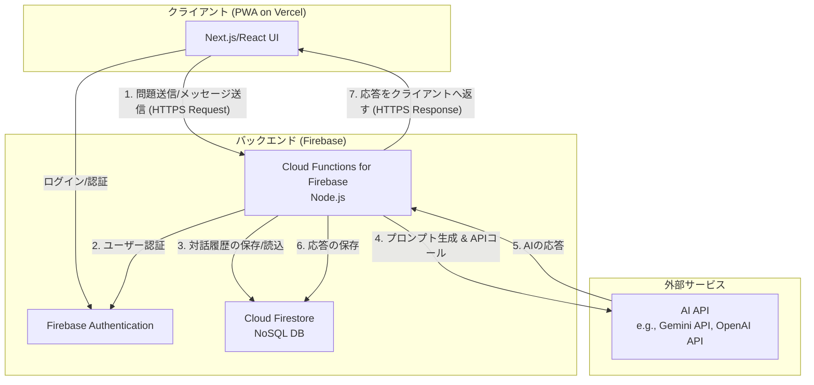

## **AI学習サポート機能 詳細設計書 (MVP)**

### **1. 概要**

本ドキュメントは、「AI学習サポート機能」のMVP開発に必要な、より詳細な仕様を定義するものです。MVPでは、ユーザーがテキストで入力した問題に対し、AIが対話形式でヒントを提供し、ユーザーの自力での問題解決を支援するコア体験の実現に焦点を当てます。

*   **目的:** AIとの対話を通じて、ユーザーが「自力で解けた」という達成感を得られるコア機能を提供する。
*   **スコープ:**
    *   **対象機能:** 「AIとの対話による問題解決フロー」のコア機能
        *   テキストによる問題入力
        *   AIによるインタラクティブなヒント提供
        *   シンプルな問題における小問題への分解
        *   対話ログの表示・保存
    *   **対象外:** 写真での問題入力、学習記録の自動登録（フェーズ4連携）、高度なパーソナライズ機能。

### **2. システムアーキテクチャ**

PWAとして構成され、VercelとFirebaseを中心にサーバーレスアーキテクチャを採用します。



**データの流れ:**

1.  **問題開始:** ユーザーがクライアントで問題を入力すると、Firebase Cloud FunctionsのAPIが呼び出されます。
2.  **セッション作成:** Cloud Functionsは新しい対話セッションをFirestoreに作成し、AI APIに最初のヒントをリクエストします。
3.  **対話:** ユーザーがメッセージを送信すると、Cloud FunctionsはFirestoreから過去の対話履歴を読み込み、新しいメッセージと合わせてAI APIに送信します。
4.  **応答:** AIの応答をFirestoreに保存し、クライアントに返却します。クライアントは受け取った応答をUIに表示します。

### **3. 画面設計 (UI/UX)**

MVPでは、主に2つの画面で構成されます。

#### **3.1. 問題入力画面**

*   **目的:** ユーザーがこれから解きたい問題を入力する。
*   **UI要素:**
    *   **ヘッダー:** アプリケーションのタイトル
    *   **入力フォーム:**
        *   タイトル: 「どんな問題でこまってる？」
        *   テキストエリア: 複数行の入力が可能なテキストエリア。「数学のこの問題がわからない…」などのプレースホルダーを表示。
        *   ボタン: 「AIに相談する」
*   **動作:**
    *   ユーザーがテキストエリアに問題を入力し、「AIに相談する」ボタンをタップすると、入力内容をバックエンドに送信し、後述の「AI対話画面」に遷移します。

#### **3.2. AI対話画面**

*   **目的:** AIと対話しながら問題を解き進める。
*   **UI要素:**
    *   **ヘッダー:** 現在取り組んでいる問題の要約（例: 「一次方程式の問題」） or 最初の入力内容
    *   **チャットビュー:**
        *   AIからのメッセージ（ヒント、小問題、質問）とユーザーからのメッセージ（回答、質問）が時系列で表示される、一般的なチャット形式のUI。
        *   AIの吹き出しとユーザーの吹き出しは、色や配置で明確に区別します。
    *   **入力フォーム:**
        *   テキスト入力フィールド
        *   送信ボタン
*   **動作:**
    *   画面を開くと、AIからの最初のメッセージ（ヒントや質問）が表示されます。
    *   ユーザーがテキストを入力して送信すると、チャットビューに自分のメッセージが追加され、少し待つとAIからの返信が追加されます。
    *   過去のやり取りは、画面をスクロールすることでいつでも確認できます。

### **4. データベース設計 (Cloud Firestore)**

*   **コレクション:**
    *   `users`: ユーザー情報を格納（Firebase AuthenticationのUIDと紐付け）。
    *   `chatSessions`: AIとの対話セッション情報を格納。
    *   `messages`: 各セッション内のメッセージ情報を格納。

*   **データ構造:**

    *   **`users`** `/users/{userId}`
        ```json
        {
          "displayName": "中村 健太",
          "createdAt": "2025-09-08T00:00:00Z"
        }
        ```

    *   **`chatSessions`** `/chatSessions/{sessionId}`
        ```json
        {
          "userId": "{userId}", // usersコレクションへの参照
          "originalProblem": "2x + 5 = 11 という方程式の解き方がわかりません。",
          "status": "active" | "completed", // "active": 対話中, "completed": 解決済み
          "createdAt": "2025-09-08T01:00:00Z",
          "updatedAt": "2025-09-08T01:05:00Z"
        }
        ```

    *   **`messages`** `/chatSessions/{sessionId}/messages/{messageId}`
        ```json
        {
          "role": "user" | "assistant", // "user": ユーザー, "assistant": AI
          "content": "xの値を求めるには、まず何をすればいいですか？",
          "timestamp": "2025-09-08T01:02:00Z"
        }
        ```
        *補足: `messages`を`chatSessions`のサブコレクションにすることで、セッションごとのメッセージを効率的に取得・管理します。*

### **5. API設計 (Cloud Functions for Firebase)**

RESTful APIとして設計します。エンドポイントは `/api/` プレフィックスを持つと仮定します。

#### **5.1. `POST /api/chatSessions`**

*   **説明:** 新しいチャットセッションを開始する。
*   **リクエストボディ:**
    ```json
    {
      "problemText": "2x + 5 = 11 という方程式の解き方がわかりません。"
    }
    ```
*   **処理:**
    1.  リクエストから`userId`を認証情報より取得。
    2.  `chatSessions`コレクションに新しいドキュメントを作成。
    3.  `problemText`をAI APIに送信し、最初の応答を要求する（プロンプト設計参照）。
    4.  AIからの最初の応答を`messages`サブコレクションに保存。
    5.  新しく作成された`sessionId`と最初のAIメッセージを返す。
*   **レスポンス (201 Created):**
    ```json
    {
      "sessionId": "some-unique-session-id",
      "initialMessage": {
        "role": "assistant",
        "content": "いい質問だね！この方程式を解くには、まず「x」がついている項だけを左辺に残すことを目指すんだ。そのためには、最初に何をするといいと思う？"
      }
    }
    ```

#### **5.2. `POST /api/chatSessions/{sessionId}/messages`**

*   **説明:** 既存のチャットセッションに新しいメッセージを投稿する。
*   **リクエストボディ:**
    ```json
    {
      "messageText": "両辺から5を引けばいいですか？"
    }
    ```
*   **処理:**
    1.  ユーザーのメッセージを`messages`サブコレクションに保存。
    2.  当該セッションの過去のメッセージ履歴を`messages`から取得。
    3.  メッセージ履歴と新しい`messageText`をAI APIに送信し、次の応答を要求。
    4.  AIからの応答を`messages`サブコレクションに保存。
    5.  AIの応答メッセージを返す。
*   **レスポンス (200 OK):**
    ```json
    {
      "aiMessage": {
        "role": "assistant",
        "content": "その通り！素晴らしいね。両辺から5を引くと、式はどうなるかな？"
      }
    }
    ```

### **6. AIプロンプト設計**

AIの振る舞いを決定する重要な要素です。AI APIに渡す指示（プロンプト）を以下のように設計します。

*   **システムプロンプト (AIの役割定義):**
    *   APIリクエストの際に常に先頭に付与し、AIの基本姿勢を定義します。
    ```
    あなたは、学習につまずいている中学生をサポートする、親しみやすく優秀な家庭教師AIです。
    あなたの目的は、ユーザーが自力で問題を解く達成感を味わえるように導くことです。

    # ルール
    - 絶対に、問題の最終的な答えや、計算結果そのものを直接教えてはいけません。
    - ユーザーの思考を促すために、常に質問形式で返答してください。例：「次は何をすればいいと思う？」
    - ユーザーが間違えた場合は、決して否定せず、「いいところに気がついたね！でも、この場合は…」のように肯定的な言葉で導いてください。
    - ユーザーの理解度に応じて、問題をより簡単なステップ（小問題）に分解して提示してください。
    - ユーザーの入力が短い場合や意図が不明な場合は、意図を明確にするための質問をしてください。
    - 言葉遣いは、中学生にも理解できるような、丁寧かつ親しみやすいものにしてください。
    ```

*   **対話履歴の付与:**
    *   ユーザーからの新しいメッセージをAIに送信する際は、システムプロンプトに加え、それまでの対話履歴（ユーザーとAIのやり取り）をすべてコンテキストとして与えます。これにより、AIは文脈を理解した応答を生成できます。
